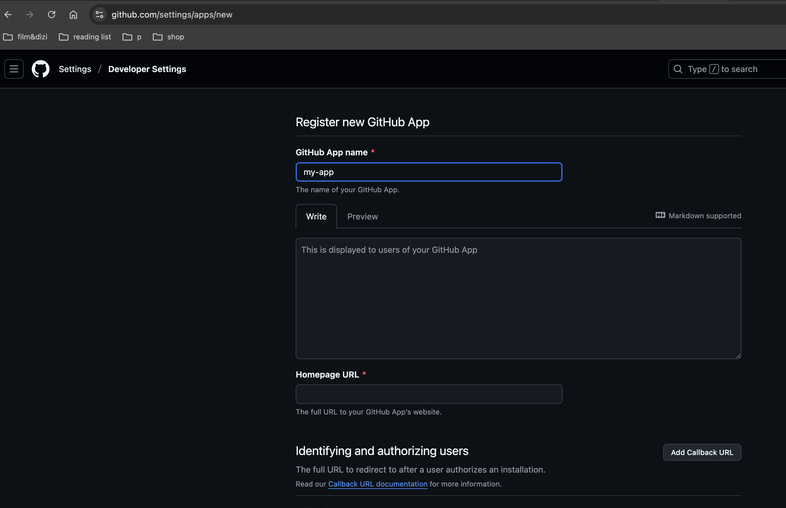
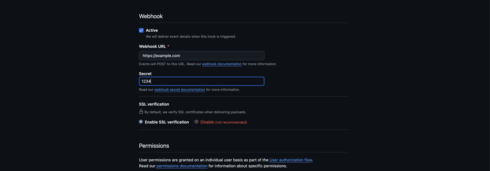
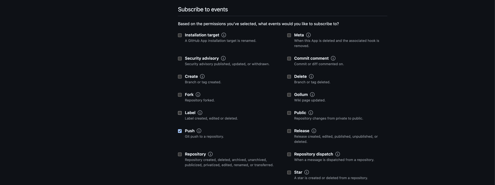
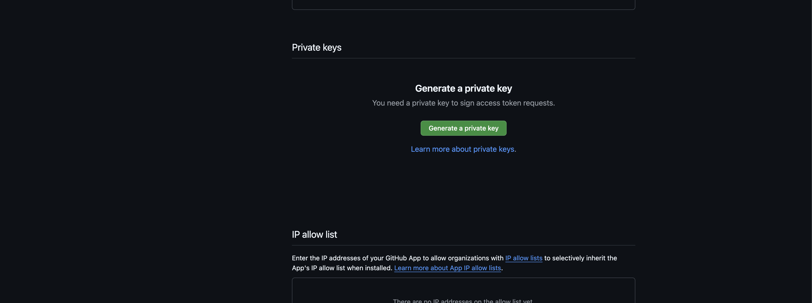
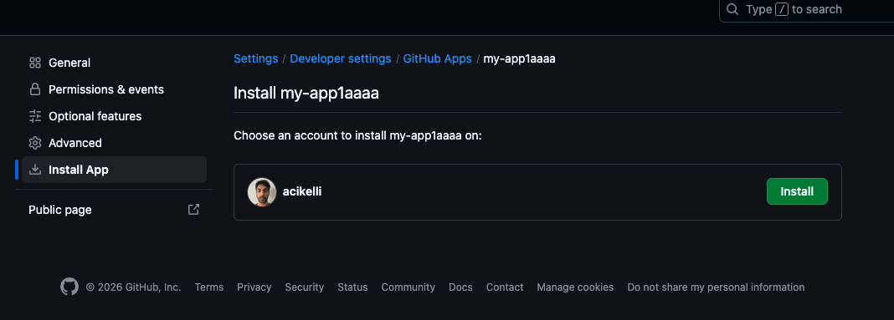
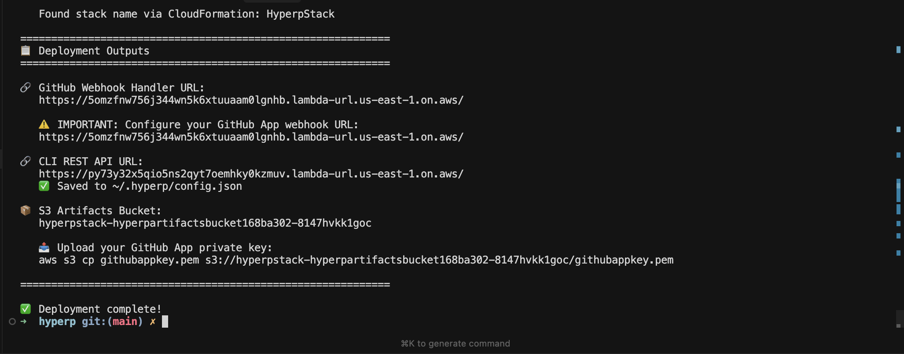

# Setup steps:

## Prerequisites

Before deploying hyperp, ensure you have:

1. **AWS Account** with appropriate permissions
2. **AWS CLI** configured with credentials
3. **Node.js** (v18 or later) and npm installed
4. **Docker** Docker must be running in order to build and deploy lambda images
5. **GitHub App** created with the following:
   - Webhook URL (will be configured after deployment)
   - Repository permissions: Contents (Read), Metadata (Read)
   - Subscribe to events: Push
   - Private key generated and downloaded

## Creating the GitHub app.

Create a GitHub App from [here](https://github.com/settings/apps/new)


You can give any name to your app.



On the webhook section, enter a temporary URL(we'll come back and update once we obtain actual URL) and a secret value(save the secret value).


Under the repository permissions, select the content option readonly.



Under the subscribe to events, check push.



Once the app is created, generate a private key and save it for the next steps.



Install the created app in your own GitHub account.

## Install and deploy hyperp

```
npm i -g hyperp
```

```
hyperp deploy --github-app-id <your app id > --github-app-webhook-secret <your secret value>
```



Once the deployment is done, it outputs the GitHub webhook handler URL. Copy the URL and replace the temporary webhook URL you entered while creating the GitHub app with the actual webhook function URL created.

Upload your GitHub App's private key to the created bucket using instructed command S3 cp command.

`   aws s3 cp githubappkey.pem s3://hyperpstack-hyperpartifactsbucket168ba302-8147hvkk1goc/githubappkey.pem`
